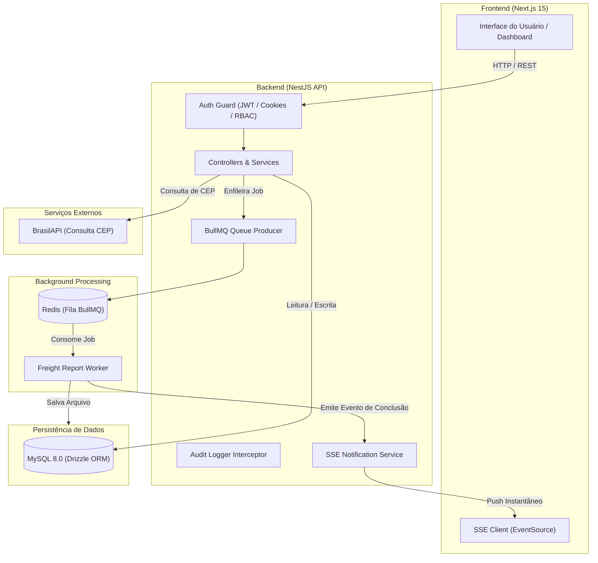

# 🚚 Logistics SaaS Enterprise

> Sistema multi-tenant de gestão logística, cálculo inteligente de fretes, processamento assíncrono de relatórios e notificações em tempo real.

---

## 📌 Sumário
- [Visão Geral](#-visão-geral)
- [Arquitetura do Sistema](#-arquitetura-do-sistema)
- [Decisões Técnicas](#-decisões-técnicas)
- [Pré-requisitos e Instalação](#-pré-requisitos-e-instalação)
- [Execução da Aplicação](#-execução-da-aplicação)
- [Testes Automatizados](#-testes-automatizados)
- [Fluxos Implementados](#-fluxos-implementados)
- [Documentação da API (Swagger)](#-documentação-da-api-swagger)

---

## 🔭 Visão Geral

O **Logistics SaaS** é uma plataforma corporativa desenvolvida para gerenciar transportadoras, clientes e cotações de fretes com isolamento seguro por empresa (*Multi-Tenancy*). O sistema realiza simulações logísticas considerando cubagem, distância geográfica e regras de ad-valorem, além de suportar operações em lote e exportações de relatórios em segundo plano com notificações instantâneas no navegador.

---

## 🏛 Arquitetura do Sistema

A solução adota uma arquitetura em camadas orientada a serviços modulares, desacoplando tarefas síncronas (requisições de API) de tarefas pesadas (processamento assíncrono).



### Destaques Arquiteturais:
1. **Multi-Tenancy por Coluna (`tenant_id`)**: Cada requisição autenticada é contextualizada para o inquilino logado, garantindo isolamento estrito de dados nas consultas via Drizzle ORM.
2. **Segurança em Camadas**: Autenticação via JWT armazenado em cookies `HttpOnly` (prevenção contra ataques XSS), rotação de Refresh Tokens, autenticação de dois fatores (2FA / TOTP) e controle de permissões baseado em funções (RBAC).
3. **Observabilidade e Rastreabilidade**: Interceptor global com injeção de `Correlation-ID` (`x-correlation-id`), logs estruturados e auditoria de ações críticas (`audit_logs`).

---

## 💡 Decisões Técnicas

| Tecnologia | Decisão / Justificativa |
| :--- | :--- |
| **NestJS + TypeScript** | Estrutura modular escalável, injeção de dependências nativa e tipagem estática robusta, acelerando a manutenção e padronização corporativa. |
| **Drizzle ORM + MySQL 8** | Substituição de ORMs pesados (como Prisma ou TypeORM) pelo Drizzle, garantindo zero overhead de runtime, SQL previsível e geração ágil de migrações com tipagem inferida diretamente do banco. |
| **Redis + BullMQ** | Gerenciamento de tarefas pesadas em segundo plano (exportação de relatórios). Permite responder requisições imediatamente (`202 Accepted`) com suporte a retentativas automáticas e controle de concorrência. |
| **Server-Sent Events (SSE)** | Escolhido em vez de WebSockets por ser uma comunicação unidirecional eficiente (servidor $\rightarrow$ cliente), nativa do protocolo HTTP, sem overhead de handshake bidirecional ou portas dedicadas, ideal para notificações de conclusão de jobs. |
| **Zod (`nestjs-zod`)** | Validação centralizada e estrita de esquemas em tempo de execução, garantindo que nenhum dado inesperado ultrapasse a camada de transporte da API. |
| **Next.js (App Router) + Tailwind CSS** | Renderização moderna, feedback de tela rápido, layout responsivo e facilidade de consumo de endpoints tipados. |

---

## 📦 Pré-requisitos e Instalação

### Pré-requisitos:
- **Node.js** v18+ ou v20+
- **Docker** e **Docker Compose**
- **npm** (incluso com o Node)

### Passo 1: Clonar o repositório
```bash
git clone <url-do-repositorio>
cd logistics-project
```

### Passo 2: Subir a infraestrutura (MySQL + Redis)
O projeto inclui um `Docker-compose.yml` pré-configurado na raiz:
```bash
docker compose up -d
```
> O MySQL subirá na porta mapeada `3307` (interna `3306`) e o Redis na porta `6379`.

### Passo 3: Configurar o Backend
1. Acesse o diretório do backend e crie o arquivo `.env`:
   ```bash
   cd backend
   cp .env.example .env
   ```
2. Instale as dependências:
   ```bash
   npm install
   ```
3. Execute as migrações no banco de dados:
   ```bash
   npm run db:migrate
   ```
   *(Caso queira sincronizar o schema diretamente em desenvolvimento, você também pode usar `npm run db:push`).*

### Passo 4: Configurar o Frontend
1. Acesse o diretório do frontend e crie o arquivo `.env`:
   ```bash
   cd ../frontend
   cp .env.example .env
   ```
2. Instale as dependências:
   ```bash
   npm install
   ```

---

## 🚀 Execução da Aplicação

### 1. Iniciar o Backend
No diretório `backend`:
```bash
npm run start:dev
```
O servidor iniciará em `http://localhost:3001`.

### 2. Iniciar o Frontend
No diretório `frontend`:
```bash
npm run dev
```
A interface do usuário estará disponível em `http://localhost:3000`.

---

## 🧪 Testes Automatizados

No diretório `backend`, você pode rodar os testes unitários e de integração:

```bash
# Rodar todos os testes unitários
npm test

# Rodar testes em modo watch
npm run test:watch

# Rodar testes com relatório de cobertura
npm run test:cov
```

---

## 🔄 Fluxos Implementados

### 1. Onboarding e Autenticação Multi-Tenant
- Criação de nova organização/tenant com usuário administrador inicial.
- Login seguro gerando par de tokens (Access Token em cookie `HttpOnly` com expiração curta + Refresh Token seguro).
- Suporte a 2FA (TOTP via Google Authenticator/Authy) e OAuth 2.0 (Google / GitHub).

### 2. Gestão de Transportadoras e Clientes
- Cadastro, edição, listagem com paginação e exclusão.
- Importação em lote via arquivos CSV (`clientes_exemplo.csv` e `transportadoras_exemplo.csv` disponíveis na raiz para testes).

### 3. Simulação Inteligente de Frete
- Entrada simplificada: apenas destino (CEP), peso e dimensões da carga (com origem padrão da empresa ou personalizada).
- Validação automática de localização geográfica via **BrasilAPI** com cálculo de distância (local, estadual ou interestadual).
- Cálculo automatizado de cubagem ($\text{Comprimento} \times \text{Largura} \times \text{Altura} / 6000$) e taxa de seguro (*ad-valorem*).
- Ranking comparativo das transportadoras cadastradas exibindo menor custo e prazo de entrega.

### 4. Processamento Assíncrono e Tempo Real (Relatórios)
1. O usuário solicita a exportação de dados na tela de relatórios.
2. O Backend enfileira o trabalho no **BullMQ/Redis** e retorna `202 Accepted` de forma não bloqueante.
3. O Worker processa o compilado em segundo plano e gera o arquivo para download.
4. Ao concluir, um evento é disparado via **Server-Sent Events (SSE)**, notificando o sino de notificações do usuário instantaneamente sem necessidade de refresh ou polling contínuo.

### 5. Auditoria de Atividades
- Cada ação relevante no sistema (criação, alteração ou exclusão de registros) é gravada na tabela de auditoria com data, hora, IP, usuário e resumo da operação.

---

## 📖 Documentação da API (Swagger)

Com o backend em execução, acesse a documentação interativa OpenAPI no navegador:
👉 **[http://localhost:3001/api/docs](http://localhost:3001/api/docs)**
