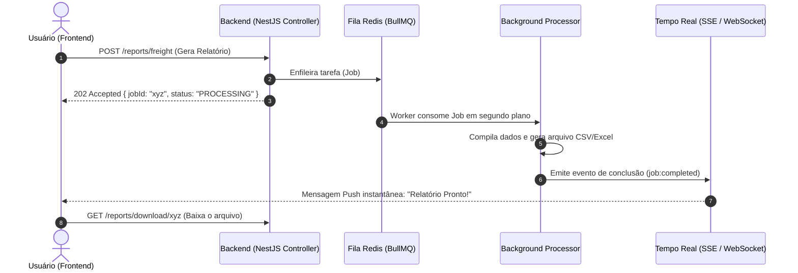

# Arquitetura & Implementação: Processamento Assíncrono e Tempo Real

Este documento detalha o conceito, as decisões arquiteturais e a estratégia prática para cumprir os requisitos de **Processamento Assíncrono** e **Comunicação em Tempo Real** no ecossistema do projeto **`logistic`**.

---

## 1. Visão Geral: Por que esses dois requisitos existem?

No desenvolvimento de sistemas web modernos, tarefas pesadas ou demoradas não devem ser executadas dentro do ciclo tradicional de requisição/resposta HTTP:

```
[Requisição Síncrona Tradicional - Ruim para tarefas pesadas]
Frontend ──(POST /relatorio)──> Backend [Processa 30 segundos...] ──(Resposta)──> Frontend
* O usuário fica com a tela travada, corre risco de Timeout HTTP (504) e degrada a performance do servidor.
```

Para resolver isso, combinamos **dois conceitos complementares**:

1. **Processamento Assíncrono (Fila / Background Job):** O backend recebe a ordem de serviço, enfileira a tarefa, salva com status `PENDING` e responde **imediatamente** (HTTP `202 Accepted`). Um processo separado (*worker*) executa o trabalho sem bloquear ninguém.
2. **Comunicação em Tempo Real (Push do Servidor):** Como a requisição HTTP já acabou, o servidor precisa de uma forma de avisar o frontend assim que o processamento terminar, **sem que o frontend precise ficar fazendo perguntas repetidas (polling)**.



---

## 2. Requisito 1: Processamento Assíncrono

### Por que usar Redis + BullMQ?
* O desafio já cita **Redis** como requisito de infraestrutura.
* **BullMQ** é a biblioteca padrão absoluta no ecossistema NestJS (`@nestjs/bullmq`) para gerenciamento de filas e background jobs.
* **Vantagens técnicas:**
  - Baixa latência e persistência em memória via Redis.
  - Suporte nativo a retentativas automáticas (*retries* em caso de falha).
  - Controle de concorrência e monitoramento de progresso (0% a 100%).
  - Atende dois critérios de avaliação com uma única ferramenta (Infraestrutura Redis + Processamento Assíncrono).

### Casos de Uso Recomendados no `logistic`:

| Caso de Uso | O que faz no segundo plano? | Complexidade |
| :--- | :--- | :--- |
| **⭐ Geração de Relatórios (Recomendado)** | Coleta histórico de simulações de frete e auditoria, formata em CSV/Excel e disponibiliza link para download. | Baixa / Muito Elegante |
| **Importação de Planilhas (Batch Import)** | Recebe um `.csv` com centenas de transportadoras ou clientes, valida dados e insere em lote no banco. | Média |
| **Simulação em Lote (Batch Simulation)** | Recebe múltiplos CEPs de destino e cota fretes em paralelo respeitando rate limit de APIs de CEP. | Média |

---

## 3. Requisito 2: Comunicação em Tempo Real

### A grande dúvida: "WebSocket é a única opção?"
**Não!** O requisito diz:
> *"A aplicação deve possuir ao menos um fluxo de atualização em tempo real entre backend e frontend. A tecnologia utilizada fica a critério do candidato."*

Existem duas formas principais no mercado:

### Comparativo: SSE (Server-Sent Events) vs WebSockets (Socket.io)

| Critério | Server-Sent Events (SSE) ⭐ | WebSockets (Socket.io) |
| :--- | :--- | :--- |
| **Complexidade** | **Mínima** (é apenas uma rota HTTP aberta) | **Média/Alta** (protocolo `ws://`, handshake, gateway dedicado) |
| **Dependências no Backend** | **Zero** (nativo do NestJS via `@Sse()`) | Requer `@nestjs/websockets` e `@nestjs/platform-socket.io` |
| **Dependências no Frontend** | **Zero** (nativo do navegador com `EventSource`) | Requer biblioteca `socket.io-client` |
| **Direção dos Dados** | **Unidirecional** (Servidor $\rightarrow$ Cliente) | **Bidirecional** (Servidor $\leftrightarrow$ Cliente) |
| **Compatibilidade com Proxies** | Excelente (funciona em portas HTTP/HTTPS comuns) | Pode exigir ajustes em proxies, load balancers e firewalls |
| **Reconexão Automática** | Nativa do próprio navegador | Gerenciada pela biblioteca Socket.io |
| **Veredito para este desafio** | **Ideal e suficiente**, pois só o servidor precisa avisar o cliente que a tarefa terminou. | Recomendado se o sistema precisasse de chat ou edição colaborativa em tempo real. |

> [!TIP]
> **Conclusão:** O **SSE** é a solução mais simples, enxuta e à prova de falhas para notificação de tarefas em tempo real. Se você preferir o **WebSocket**, ele também atende perfeitamente, apenas exigindo um pouco mais de boilerplate.

---

## 4. Arquitetura Prática Proposta (Passo a Passo)

### Passo 1: Adicionar o Redis no `Docker-compose.yml`
Basta incluir o serviço `redis` no seu Docker Compose já existente:

```yaml
version: '3.8'

services:
  mysql:
    image: mysql:8.0
    container_name: logistics_mysql
    restart: unless-stopped
    ports:
      - "3307:3306"
    environment:
      MYSQL_ROOT_PASSWORD: password5000
      MYSQL_DATABASE: logistics_db
      MYSQL_USER: logistics_user
      MYSQL_PASSWORD: logistics_password
    volumes:
      - mysql_data:/var/lib/mysql

  redis:
    image: redis:7-alpine
    container_name: logistics_redis
    restart: unless-stopped
    ports:
      - "6379:6379"

volumes:
  mysql_data:
```

---

### Passo 2: Instalar as dependências no backend
```bash
npm install @nestjs/bullmq bullmq
```

---

### Passo 3: Backend - Endpoint de Enfileiramento e Worker

#### A) O Controller recebe o pedido e responde imediatamente:
```typescript
@Post('export')
@HttpCode(HttpStatus.ACCEPTED) // Retorna HTTP 202
async requestReportExport(@CurrentUser() user: AuthUser) {
  const job = await this.reportQueue.add('generate-freight-report', {
    tenantId: user.tenantId,
    userId: user.id,
  });

  return {
    jobId: job.id,
    status: 'PROCESSING',
    message: 'A geração do relatório foi enfileirada com sucesso.',
  };
}
```

#### B) O Processador (Worker) executa o trabalho:
```typescript
@Processor('reports')
export class ReportProcessor extends WorkerHost {
  constructor(private readonly sseService: SseNotificationService) {
    super();
  }

  async process(job: Job<{ tenantId: string; userId: string }>) {
    // 1. Busca dados no MySQL (ex: simulações de frete)
    // 2. Monta o arquivo CSV/Excel
    // 3. Notifica o frontend em tempo real via SSE
    this.sseService.notifyUser(job.data.userId, {
      type: 'REPORT_READY',
      jobId: job.id,
      downloadUrl: `/api/reports/download/${job.id}.csv`,
      message: 'Seu relatório de fretes está pronto para download!',
    });
  }
}
```

---

### Passo 4: Backend - Endpoint em Tempo Real (SSE)
No NestJS, o SSE é nativo e usa RxJS `Observable`:

```typescript
@Controller('notifications')
export class NotificationsController {
  constructor(private readonly sseService: SseNotificationService) {}

  @Sse('stream')
  stream(@Query('userId') userId: string): Observable<MessageEvent> {
    return this.sseService.getUserEventStream(userId);
  }
}
```

---

### Passo 5: Como o Frontend consome em Tempo Real (Sem bibliotecas)
No frontend (JavaScript / React / Vue / Vanilla):

```javascript
// Abre a conexão em tempo real com o backend (HTTP nativo)
const eventSource = new EventSource('http://localhost:3000/notifications/stream?userId=123');

// Escuta notificações enviadas pelo servidor
eventSource.onmessage = (event) => {
  const data = JSON.parse(event.data);
  
  if (data.type === 'REPORT_READY') {
    // Exibe toast/notificação na tela
    alert(data.message);
    // Cria link ou dispara download automático
    window.open(data.downloadUrl, '_blank');
  }
};
```

---

## 5. Texto de Documentação Técnica Pronta (Para o README do Projeto)

O edital exige: *"A solução escolhida deve ser documentada."*  
Você pode incluir o texto abaixo diretamente no seu `README.md`:

> ### 📄 Documentação Técnica: Processamento Assíncrono e Tempo Real
>
> #### 1. Processamento Assíncrono com Redis e BullMQ
> * **Problema:** A geração e exportação de relatórios analíticos de simulação de frete envolve agregação de dados históricos, formatação de arquivos e cálculos de métricas logísticas, o que causaria bloqueio da thread e risco de timeout HTTP sob alta concorrência.
> * **Solução Adotada:** Implementação de fila de mensagens assíncrona utilizando **BullMQ** com persistência em **Redis** via container Docker. A requisição HTTP responde de imediato com status `202 Accepted` e identificador do Job (`jobId`), enquanto um worker dedicado processa a extração dos dados em segundo plano com suporte a retentativas em caso de instabilidade.
>
> #### 2. Comunicação em Tempo Real via Server-Sent Events (SSE)
> * **Problema:** Evitar que o cliente realize *polling* contínuo (requisições repetidas a cada poucos segundos) para consultar o status de conclusão do job em background.
> * **Solução Adotada:** Implementação de fluxo reativo em tempo real via **Server-Sent Events (SSE)** nativo do NestJS (`@Sse`). O cliente mantém uma conexão persistente e leve aberta. Assim que o processador assíncrono conclui a geração do relatório, o evento `REPORT_READY` é empurrado (*push*) para o frontend contendo o link de download e sumário do processamento, garantindo atualização instantânea da interface com mínimo consumo de rede.
