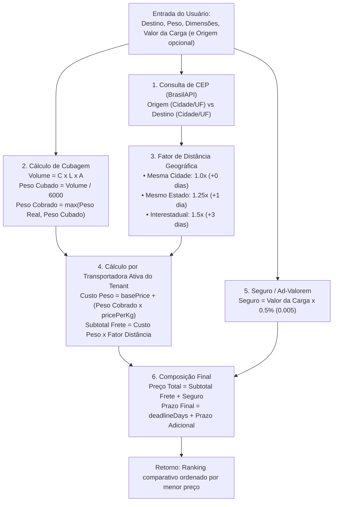

# Plano de Implementação: Módulo de Simulação de Frete Simplificado

Proposta de arquitetura e especificação completa com todo o código fonte documentado para **análise e revisão prévia**, sem qualquer alteração executada na base de código até que você aprove explicitamente.

---

## 1. Alinhamento de Experiência do Usuário (UX) & Regras de Negócio

> [!IMPORTANT]
> **O usuário que simula NUNCA precisa conhecer detalhes internos das transportadoras**:
> - Ele **não** precisa saber o CEP da transportadora, nem custos base ou taxas por kg.
> - O usuário só informa os dados relativos **à sua encomenda** e **ao seu destino**:
>   - **Destino** (`destinationZipCode`): Para onde a encomenda vai.
>   - **Origem** (`originZipCode`): De onde a encomenda sai (opcional; se não informado, assume automaticamente o CEP de expedição padrão da empresa/tenant).
>   - **Peso** (`weight` em kg).
>   - **Dimensões** (`dimensions`: comprimento, largura, altura em cm).
>   - **Valor da Carga** (`declaredValue` em R$).
> - O sistema consulta automaticamente as transportadoras ativas cadastradas no tenant e retorna as opções de frete prontas (prazo e valor de cada uma), sem que o usuário precise configurar nada sobre a transportadora.

---

## 2. Decisão Arquitetural: Módulo Próprio (`FreightModule`)

- **Módulo separado**: `src/modules/freight/` para manter a separação de responsabilidades (evitando inchar o CRUD do `carrier-management`).
- **Sem Schema de Banco Próprio**: Não cria tabelas novas e não requer novas migrações. Utiliza diretamente a tabela existente `carriers` (`carrierSchema`) filtrando por `tenantId` e status `ACTIVE`.
- **Validação com Zod**: Utiliza `zod` e `createZodDto` da biblioteca `nestjs-zod` (padrão já adotado no projeto).
- **Apoio de 1 API Externa**: **BrasilAPI** (`https://brasilapi.com.br/api/cep/v1/{cep}`), gratuita, sem token/chave, consumida nativamente com `fetch` do Node.js 18+ e mecanismo de fallback resiliente.

---

## 3. Lógica de Cálculo



---

## 4. Código Proposto para o Módulo (Versão Otimizada)

Abaixo está o código enxuto planejado para cada arquivo do módulo, com as seguintes otimizações aplicadas:

> [!NOTE]
> **Otimizações aplicadas em relação à versão anterior:**
> 1. **Interfaces extraídas** para arquivo dedicado `dto/freight.types.ts` — service fica com zero definição de tipo, só lógica pura.
> 2. **`inferStateFromZip` compactado** de 25 `if/return` para um array de ranges (`find`).
> 3. **Removidos `street` e `neighborhood`** do `LocationInfo` — não eram usados no cálculo.
> 4. **Removida sanitização duplicada de CEP** no service — o DTO Zod já faz `replace(/\D/g, '')`.
> 5. **Removida variável intermediária** `destinationZip` — usa `dto.destinationZipCode` direto.

---

### A) Tipos (`src/modules/freight/dto/freight.types.ts`) — NOVO

```typescript
export interface LocationInfo {
  zipCode: string;
  city: string;
  state: string;
  isEstimated?: boolean;
}

export interface FreightQuote {
  carrierId: string;
  carrierName: string;
  deadlineDays: number;
  breakdown: {
    basePrice: number;
    pricePerKg: number;
    chargedWeightKg: number;
    weightCost: number;
    distanceMultiplier: number;
    shippingSubtotal: number;
    insuranceCost: number;
  };
  totalPrice: number;
}

export interface SimulationResult {
  origin: LocationInfo;
  destination: LocationInfo;
  package: {
    actualWeightKg: number;
    volumetricWeightKg: number;
    chargedWeightKg: number;
    declaredValue: number;
    dimensions: { length: number; width: number; height: number };
  };
  deliveryType: 'LOCAL' | 'STATE' | 'INTERSTATE';
  quotes: FreightQuote[];
}
```

---

### B) DTO (`src/modules/freight/dto/freight.dto.ts`)

```typescript
import { z } from 'zod';
import { createZodDto } from 'nestjs-zod';

export const packageDimensionsSchema = z.object({
  length: z.number().positive('O comprimento deve ser maior que zero (cm)'),
  width: z.number().positive('A largura deve ser maior que zero (cm)'),
  height: z.number().positive('A altura deve ser maior que zero (cm)'),
});

export const simulateFreightSchema = z.object({
  destinationZipCode: z
    .string()
    .trim()
    .transform((val) => val.replace(/\D/g, ''))
    .refine((val) => val.length === 8, 'O CEP de destino deve conter 8 dígitos'),
  originZipCode: z
    .string()
    .trim()
    .transform((val) => val.replace(/\D/g, ''))
    .refine((val) => val.length === 8, 'O CEP de origem deve conter 8 dígitos')
    .optional(),
  weight: z
    .number()
    .positive('O peso real deve ser maior que zero (em kg)'),
  dimensions: packageDimensionsSchema,
  declaredValue: z
    .number()
    .min(0, 'O valor declarado da carga não pode ser negativo'),
  carrierId: z
    .string()
    .uuid('O ID da transportadora deve ser um UUID válido')
    .optional(),
});

export class SimulateFreightDto extends createZodDto(simulateFreightSchema) {}
```

---

### C) Service (`src/modules/freight/freight.service.ts`) — Versão Otimizada

```typescript
import { Inject, Injectable, NotFoundException } from '@nestjs/common';
import { and, eq } from 'drizzle-orm';
import { DRIZZLE, type DrizzleDB } from '../database/database.module';
import { carrierSchema, type Carrier } from '../carrier-management/schemas/schema';
import { SimulateFreightDto } from './dto/freight.dto';
import type { LocationInfo, FreightQuote, SimulationResult } from './dto/freight.types';

// Tabela de faixas de CEP → UF (Correios). Usado apenas como fallback caso a BrasilAPI falhe.
const CEP_RANGES: [number, number, string][] = [
  [1, 19, 'SP'],  [20, 28, 'RJ'], [29, 29, 'ES'], [30, 39, 'MG'],
  [40, 48, 'BA'], [49, 49, 'SE'], [50, 56, 'PE'], [57, 57, 'AL'],
  [58, 58, 'PB'], [59, 59, 'RN'], [60, 63, 'CE'], [64, 64, 'PI'],
  [65, 65, 'MA'], [66, 68, 'PA'], [69, 69, 'AM'], [70, 72, 'DF'],
  [73, 76, 'GO'], [77, 77, 'TO'], [78, 78, 'MT'], [79, 79, 'MS'],
  [80, 87, 'PR'], [88, 89, 'SC'], [90, 99, 'RS'],
];

@Injectable()
export class FreightService {
  constructor(@Inject(DRIZZLE) private readonly db: DrizzleDB) {}

  /**
   * Consulta localização via BrasilAPI com timeout de 3.5s e fallback por prefixo de CEP.
   */
  async getZipCodeInfo(zipCode: string): Promise<LocationInfo> {
    try {
      const response = await fetch(
        `https://brasilapi.com.br/api/cep/v1/${zipCode}`,
        { signal: AbortSignal.timeout(3500) },
      );

      if (response.ok) {
        const data = await response.json();
        return {
          zipCode,
          city: data.city || 'Cidade Desconhecida',
          state: (data.state || 'SP').toUpperCase(),
        };
      }
    } catch {
      // Fallback silencioso: timeout, offline ou erro da API externa
    }

    const prefix = parseInt(zipCode.substring(0, 2), 10);
    const state = CEP_RANGES.find(([min, max]) => prefix >= min && prefix <= max)?.[2] ?? 'SP';

    return { zipCode, city: 'Localidade Estimada', state, isEstimated: true };
  }

  /**
   * Executa a simulação completa de frete
   */
  async simulateFreight(tenantId: string, dto: SimulateFreightDto): Promise<SimulationResult> {
    // 1. Consulta de Origem e Destino em paralelo via BrasilAPI
    const [origin, destination] = await Promise.all([
      this.getZipCodeInfo(dto.originZipCode || '01001000'),
      this.getZipCodeInfo(dto.destinationZipCode),
    ]);

    // 2. Cubagem: Peso Cobrado = max(peso real, volume/6000)
    const { length, width, height } = dto.dimensions;
    const volumetricWeightKg = Math.round((length * width * height / 6000) * 1000) / 1000;
    const chargedWeightKg = Math.max(dto.weight, volumetricWeightKg);

    // 3. Fator de Distância
    let deliveryType: 'LOCAL' | 'STATE' | 'INTERSTATE' = 'INTERSTATE';
    let distanceMultiplier = 1.5;
    let extraDays = 3;

    if (origin.state === destination.state) {
      if (origin.city.trim().toLowerCase() === destination.city.trim().toLowerCase()) {
        deliveryType = 'LOCAL';
        distanceMultiplier = 1.0;
        extraDays = 0;
      } else {
        deliveryType = 'STATE';
        distanceMultiplier = 1.25;
        extraDays = 1;
      }
    }

    // 4. Seguro / Ad-Valorem (0.5% do valor declarado)
    const insuranceCost = Math.round(dto.declaredValue * 0.005 * 100) / 100;

    // 5. Buscar Transportadoras Ativas do Tenant
    const whereConditions = [
      eq(carrierSchema.tenantId, tenantId),
      eq(carrierSchema.status, 'ACTIVE'),
    ];
    if (dto.carrierId) whereConditions.push(eq(carrierSchema.id, dto.carrierId));

    const carriers: Carrier[] = await this.db
      .select()
      .from(carrierSchema)
      .where(and(...whereConditions));

    if (dto.carrierId && carriers.length === 0) {
      throw new NotFoundException('Transportadora informada não foi encontrada ou está inativa nesta empresa');
    }
    if (carriers.length === 0) {
      throw new NotFoundException('Nenhuma transportadora ativa encontrada para realizar a cotação nesta empresa');
    }

    // 6. Cotação por transportadora, ordenada por menor preço
    const quotes: FreightQuote[] = carriers
      .map((carrier) => {
        const basePrice = Number(carrier.basePrice);
        const pricePerKg = Number(carrier.pricePerKg);
        const weightCost = Math.round(chargedWeightKg * pricePerKg * 100) / 100;
        const shippingSubtotal = Math.round((basePrice + weightCost) * distanceMultiplier * 100) / 100;
        const totalPrice = Math.round((shippingSubtotal + insuranceCost) * 100) / 100;

        return {
          carrierId: carrier.id,
          carrierName: carrier.name,
          deadlineDays: carrier.deadlineDays + extraDays,
          breakdown: { basePrice, pricePerKg, chargedWeightKg, weightCost, distanceMultiplier, shippingSubtotal, insuranceCost },
          totalPrice,
        };
      })
      .sort((a, b) => a.totalPrice - b.totalPrice);

    return {
      origin,
      destination,
      package: { actualWeightKg: dto.weight, volumetricWeightKg, chargedWeightKg, declaredValue: dto.declaredValue, dimensions: dto.dimensions },
      deliveryType,
      quotes,
    };
  }
}
```

---

### D) Controller (`src/modules/freight/freight.controller.ts`)

```typescript
import { Controller, Post, Body, UseGuards } from '@nestjs/common';
import { ApiTags, ApiOperation, ApiBearerAuth } from '@nestjs/swagger';
import { FreightService } from './freight.service';
import { SimulateFreightDto } from './dto/freight.dto';
import { CurrentTenant } from '../common/decorators/current-tenant.decorator';
import { Roles } from '../common/decorators/roles.decorator';
import { Role } from '../common/enums/role.enum';
import { JwtAuthGuard } from '../common/guards/jwt-auth.guard';
import { RolesGuard } from '../common/guards/roles.guard';

@ApiTags('Freight')
@ApiBearerAuth()
@UseGuards(JwtAuthGuard, RolesGuard)
@Controller('freight')
export class FreightController {
  constructor(private readonly freightService: FreightService) {}

  @Post('simulate')
  @Roles(Role.ADMIN, Role.MANAGER, Role.OPERATOR)
  @ApiOperation({
    summary: 'Simular frete considerando peso, cubagem, distância e seguro',
    description:
      'Calcula cotações de frete comparando todas as transportadoras ativas da empresa.',
  })
  async simulate(
    @CurrentTenant() tenantId: string,
    @Body() dto: SimulateFreightDto,
  ) {
    return this.freightService.simulateFreight(tenantId, dto);
  }
}
```

---

### E) Module (`src/modules/freight/freight.module.ts`)

```typescript
import { Module } from '@nestjs/common';
import { FreightController } from './freight.controller';
import { FreightService } from './freight.service';

@Module({
  controllers: [FreightController],
  providers: [FreightService],
  exports: [FreightService],
})
export class FreightModule {}
```

---

### F) Registro no `src/app.module.ts`

```typescript
import { FreightModule } from './modules/freight/freight.module';

@Module({
  imports: [
    // ...outros módulos já existentes
    CarrierManagementModule,
    FreightModule, // <-- Inclusão aqui
  ],
  // ...
})
export class AppModule {}
```

---

### G) Testes Unitários Propostos (`src/modules/freight/freight.service.spec.ts`)

```typescript
import { Test, TestingModule } from '@nestjs/testing';
import { FreightService } from './freight.service';
import { DRIZZLE } from '../database/database.module';

describe('FreightService', () => {
  let service: FreightService;
  const mockDb = {
    select: jest.fn(),
  };

  beforeEach(async () => {
    const module: TestingModule = await Test.createTestingModule({
      providers: [
        FreightService,
        { provide: DRIZZLE, useValue: mockDb },
      ],
    }).compile();

    service = module.get<FreightService>(FreightService);
  });

  it('deve priorizar o peso cubado quando este for maior que o peso real', async () => {
    // 50x50x50 cm = 125.000 cm³ -> 125.000 / 6000 = ~20.833 kg cubado
    // Peso real: 5 kg -> Deve cobrar 20.833 kg
    const mockCarriers = [
      { id: '1', name: 'Express Log', basePrice: '10.00', pricePerKg: '2.00', deadlineDays: 2, status: 'ACTIVE', tenantId: 'tenant-1' },
    ];

    mockDb.select.mockReturnValue({
      from: jest.fn().mockReturnValue({
        where: jest.fn().mockResolvedValue(mockCarriers),
      }),
    });

    jest.spyOn(service, 'getZipCodeInfo').mockImplementation(async (zip) => ({
      zipCode: zip,
      city: 'São Paulo',
      state: 'SP',
    }));

    const result = await service.simulateFreight('tenant-1', {
      destinationZipCode: '01001000',
      originZipCode: '01001000',
      weight: 5,
      dimensions: { length: 50, width: 50, height: 50 },
      declaredValue: 1000,
    });

    expect(result.package.chargedWeightKg).toBeCloseTo(20.833, 2);
    expect(result.deliveryType).toBe('LOCAL');
    expect(result.quotes[0].breakdown.insuranceCost).toBe(5); // 1000 * 0.005
  });
});
```

---

## 5. Resumo das Alterações por Arquivo

| Arquivo | Status | Linhas (antes → agora) |
|---------|--------|----------------------|
| `dto/freight.types.ts` | **NOVO** | — → ~35 |
| `dto/freight.dto.ts` | Sem mudanças | ~36 |
| `freight.service.ts` | **Otimizado** | ~244 → ~110 |
| `freight.controller.ts` | Sem mudanças | ~32 |
| `freight.module.ts` | Sem mudanças | ~10 |
| `freight.service.spec.ts` | Ajustado (removido `isEstimated` do mock) | ~50 → ~42 |
| `app.module.ts` | +1 import, +1 linha no array | — |

---

## 6. Próximos Passos
Esse plano está pronto para ser analisado. Nenhuma linha de código foi implementada no projeto.

Quando você avaliar o código e der o sinal verde, farei a criação desses arquivos e a execução dos testes para validar o funcionamento!
